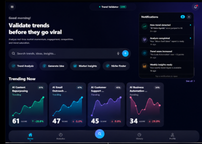

<h1 align="center">Trend Validator</h1>
<p align="center">AI-powered trend analysis — mobile app + API that scores whether a trend is worth acting on.</p>

<p align="center">
  
  
  
  
</p>

<p align="center">
  <!-- replace with a real screenshot/gif of the Results screen -->
  
</p>

---

## What it does

User types a trend/topic → app returns a **score, growth trajectory, risk/opportunity breakdown, and AI-written analysis** — pulling real Google Trends data (SerpAPI) and synthesizing it through OpenAI with Groq as automatic fallback.

## Architecture

```
Mobile (Expo) → POST /api/analyze → [SerpAPI Trends] → [OpenAI, fallback: Groq] → JSON response → UI
                                            ↓
                                   Firestore (credit ledger, history)
```

- **Provider fallback** — if OpenAI is down/rate-limited, backend automatically retries via Groq, no user-facing failure
- **Credit system** — reserve-before-call, auto-refund on upstream failure (502), so users are never charged for a failed request
- **UI-stable response contract** — backend output matches the original mock-data shape exactly, so the entire component tree (score ring, sparkline, risk bars) needed zero changes when wired to the real API

## Tech Stack

**Frontend** — React Native, Expo SDK 52, custom SVG charts (no chart library)
**Backend** — Node.js, Express, Firebase Admin (Firestore + Auth)
**AI/Data** — OpenAI (primary), Groq (fallback), SerpAPI (Google Trends)

## Run it locally

Full setup, environment variables, and troubleshooting: **[docs/SETUP.md](docs/SETUP.md)**

Quick start:
```bash
cd backend && npm install && npm run dev
cd frontend && npm install && npx expo start
```

## Status

Actively developed. Auth currently runs in a dev-bypass mode pending `@react-native-firebase/auth` integration on the client — see [docs/SETUP.md](docs/SETUP.md#auth-bypass--important).

---

<p align="center"><sub>Built by <a href="https://github.com/areeba-dev-eng">Areeba Afzal</a> — MT Software</sub></p>